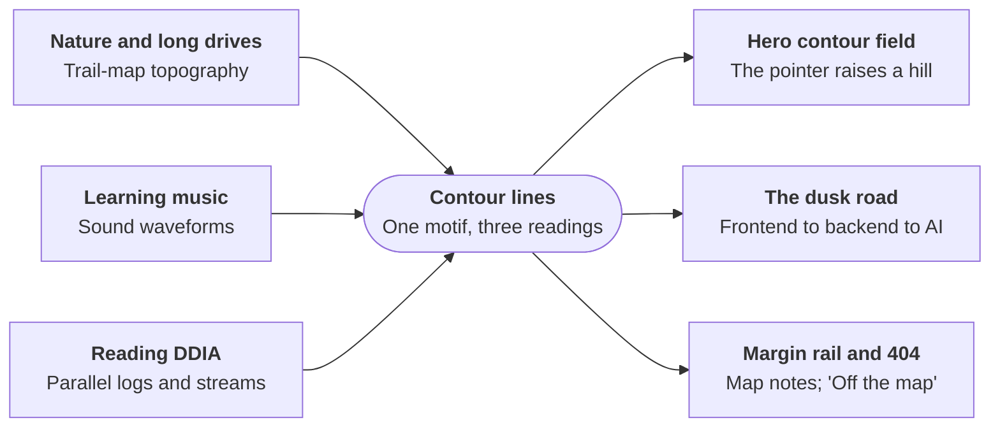
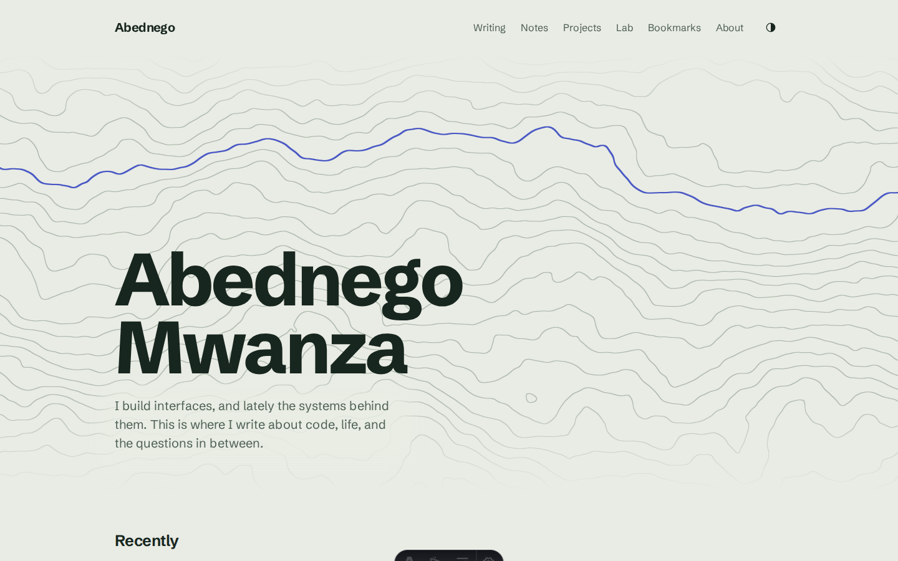
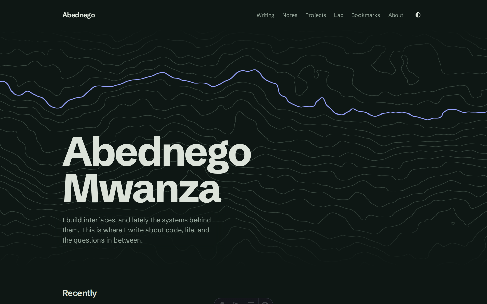
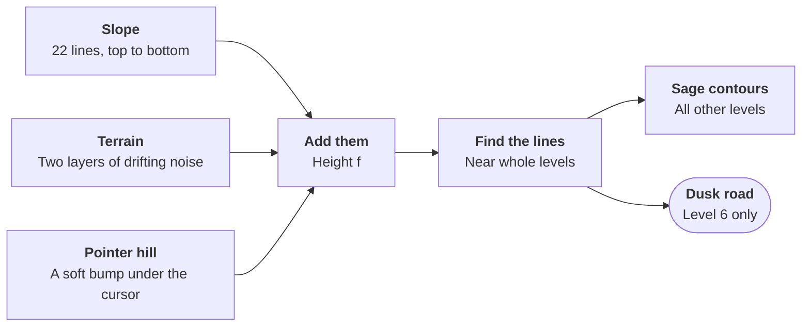

# abednego.dev — Design decisions

As of 2 October 2026. The editable version of this document lives in Claude Docs; this copy is kept in the repo for reference.

## The brief

The site is a digital garden for a software engineer with deep frontend experience who is moving into backend and AI engineering. It has to work for three readers at once: clients deciding whether to hire, other developers reading the writing, and the owner as a personal space to think in public.

The constraints that shaped every decision:

- **Writing is the product.** Essays cover engineering, life, philosophy and faith, and science and the universe, so long-form reading comfort comes first.
- **Clean and minimal, with one standout animation.** The owner asked for polished motion; the design keeps it to a single signature piece.
- **Launch with every section, fill it slowly.** Writing, notes, projects, lab, bookmarks, about, CV, uses and now all exist from day one, and empty sections must still read as intentional.
- **Light and dark themes**, following the system setting with a manual toggle.
- **Not templated.** The design was produced with the frontend-design plugin's process: a token plan, a review against common generated-design defaults, then build and screenshot critique.

## Inspiration: "Contours"

The whole design grows from one motif, the contour line, because it is the one shape that three of the owner's interests share.

- **Nature, parks and long drives.** Contour lines are the topography of a trail map: the view of a landscape from above, and of a road winding through it.
- **Learning music.** Turned on its side, a stack of wavering lines reads as sound waveforms.
- **Reading *Designing Data-Intensive Applications*.** Parallel lines that flow and occasionally fold are logs and streams of data moving through a system.

The site is framed as the map of a curious mind's journey. The motif is bold in exactly one place, the hero, and appears elsewhere only as quiet structure: ruled rows, the margin rail, the faint contour placeholder on project covers, and the 404 page, titled "Off the map". The accent line through the hero is a road, standing for the owner's path from frontend to backend to AI.

## Colour

The palette is a landscape seen at dusk: lichen-grey ground, pine-green ink, sage contour lines, and one dusk-indigo accent. Every colour is a named token in `src/styles/tokens.css`, so components refer to roles, never hex values.

| Token | Light | Dark ("night drive") | Role |
| --- | --- | --- | --- |
| `--lichen` | `#E9ECE4` | `#0E1714` | Page background |
| `--fog` | `#D5DBD1` | `#18241F` | Surfaces, code blocks |
| `--pine` | `#17261F` | `#DCE3DA` | Primary text |
| `--moss` | `#4F6055` | `#93A398` | Secondary text |
| `--sage` | `#8A9A8C` | `#4E5F55` | Contour lines and rules only |
| `--dusk` | `#4453C4` | `#97A3FF` | The single accent: links, focus, the road |

Why these choices:

- **Cool lichen, not cream.** A warm cream background with a terracotta accent is one of the most common looks in generated design. A cool green-grey ties to the nature theme and avoids that default.
- **Dusk indigo, not acid green or warm clay.** It is the colour of the sky late on a long drive, it reads as calm rather than loud, and it stays distinct from the greens around it.
- **Pine instead of near-black.** Text is a very dark green, so the ink belongs to the same landscape as the ground.
- **Dark mode is the same place at night**, not an inverted copy: the ground becomes forest-night and the accent lightens so it still glows.
- **Sage never carries text.** It measured only 2.5:1 against the background, below the WCAG AA minimum of 4.5:1, so it is limited to lines and rules. `--moss` was added for secondary text and passes at 4.7:1 or better in both themes.

## Typography

Two clearly different families do two jobs: a grotesque for the interface and headlines, a serif for reading. A third, monospace, appears only inside code.

| Typeface | Used for | Why |
| --- | --- | --- |
| Schibsted Grotesk | Headings, nav, UI, the hero name | Sturdy and slightly editorial, with more character than the usual Inter or Space Grotesk. Set large and tight, the name in the hero is itself a design element. |
| Literata | Long-form body text | Designed for reading on screens. A serif suits essays on philosophy and life, and it contrasts clearly with the grotesque. |
| JetBrains Mono | Code blocks and inline code only | Clear for code. It is kept off labels and metadata, where a monospace face is a common templated tell. |

Rules the type follows:

- **A 1.25 (major third) scale**, from 0.8rem up to 3.05rem, plus a fluid hero size of 3–7.5rem.
- **Comfortable reading:** body text at 1.125rem with 1.65 line height, at most 68 characters per line. Serif body text gets slightly more line height than sans-serif would.
- **Sentence case everywhere.** No all-caps labels, and no single word in a headline picked out in a different colour or style.
- **Self-hosted fonts** via Fontsource, so there are no third-party font requests.

## Layout

Everything is left-aligned on a single reading column, and structure carries information rather than decoration.

- **The margin rail.** On desktop, every post and list has a narrow left column (11rem) holding the date, reading time, section and topic, like the notes in the margin of a map. It replaces the common "date · time · tag" meta strings. On mobile it folds into one line above the title.
- **Rows, not cards.** The home page "Recently" list, writing, notes and lab are ruled rows with the date in the rail. Projects are full-width rows with a large cover. A grid of identical rounded cards with soft shadows is the most common generated layout, and it chops content up without saying anything.
- **Numbers only for real sequences.** Numbered markers appear only in project case-study steps, which really are ordered.
- **Empty sections give direction.** A section with no entries shows one plain line and a link to the RSS feed, for example "No essays published yet. Follow the RSS feed to hear when it does."
- **Information architecture.** Writing, notes, projects, lab, bookmarks and about sit in the main nav; now, uses, CV and RSS sit in the footer. Writing is one section with four topics (engineering, life, philosophy and faith, science and the universe), not four separate blogs.

## Motion

Boldness is spent once: the hero is the only motion that plays on its own. Everything else moves only in answer to something the reader does.

| Motion | Trigger | Purpose |
| --- | --- | --- |
| Hero contour field | Plays on load; the pointer raises a hill | The signature moment |
| Page crossfade, 260ms | Navigating | Keeps the reader oriented between pages |
| Title and cover morph | Opening an entry from a list | Shows that the row became the page |
| Case-study story | Scrolling a project | The figure follows the step being read; the accent "road" fills to show progress |
| Colour and underline changes | Hover and focus | Confirms what is interactive |

What was deliberately left out: fade-and-slide-up entrances on every section, hover lifts on every card, a custom cursor, magnetic buttons, and smooth-scroll hijacking. Each is common and reads as generated; together they would compete with the hero.

Reduced motion is respected everywhere. With the system setting on, page transitions are skipped, the story's road shows fully drawn, and the hero stays a static drawing. Turning the setting on mid-visit stops the hero immediately.

## The hero

The hero is a slowly drifting contour map drawn by one WebGL shader, with the name set over it. It is the site's only bold element.

Why it is built this way:

- **Contours on a slope, not pure noise.** Each line is a level of slope plus terrain, so the lines stay stacked like a waveform but fold and occasionally close into loops like a real map. Pure noise would read as random blobs.
- **The road is one contour level.** Drawing level 6 in dusk indigo gives a winding road that crosses the whole field and bends with the terrain. It sits above the name so the two bold elements never overlap.
- **The pointer raises a hill.** It is the only interaction, and the lines bend around it. Tapping does the same on phones; tilt was ruled out because iOS asks permission for motion sensors.
- **Crisp 1px lines at any size.** Line width is measured in screen pixels, so lines stay sharp on any display.
- **Quiet arrival.** The page first paints a static SVG drawing of the field, then crossfades to the live version once its first frame is ready. That crossfade is the page's one orchestrated moment, and the SVG stays as the fallback for reduced motion or missing WebGL.
- **Edges fade into the page**, and the colours come from the theme tokens, so the field switches instantly with the theme toggle.

## Defaults avoided, and what review changed

The first draft was checked against the patterns generated design tends to fall into, and seven decisions changed as a result. Four came from reviewing the plan; three came from screenshots of the built hero.

| Stage | First draft | Changed to | Why |
| --- | --- | --- | --- |
| Plan review | Cream background | Cool lichen green-grey | Cream with a warm accent is a generated-design default |
| Plan review | Warm accent | Dusk indigo | Ties to long drives; avoids terracotta and acid green |
| Plan review | Card grid for "latest" | Mixed list of rows | Identical cards are the most common template layout |
| Plan review | Custom cursor, magnetic buttons | Removed | Scattered effects compete with the one signature moment |
| Screenshot review | Road ran through the name | Road moved above the name | Two bold elements were fighting each other |
| Screenshot review | Evenly spaced wavy lines | More terrain, real folds and loops | It read as a waveform, not a map |
| Screenshot review | Hard edges top and bottom | Field fades into the page | Hard cuts made it look like a pasted image |

Other tells kept out on purpose: all-caps eyebrow labels above headings, "→" appended to links, monospace metadata labels, and gradient washes as decoration.

## Technical decisions that serve the design

The stack was chosen so that pages stay fast and quiet by default and only the hero and case studies pay for motion.

| Decision | Chosen over | Reason |
| --- | --- | --- |
| Astro, static output | Next.js | Pages ship with no JavaScript unless they need it; Markdown and MDX are first-class for writing. |
| Raw WebGL2 shader for the hero | Three.js | The hero is one full-screen shader. Raw WebGL costs about 7KB, against roughly 150KB for Three.js features we would not use. |
| GSAP, loaded only on case-study pages | GSAP site-wide, or no library | ScrollTrigger handles the pinned story reliably, and pages without a story never download it. |
| Native scrolling | Lenis smooth scroll | Taking over scrolling is an effect visitors notice and often dislike; it would break the motion principle. |
| Astro View Transitions | A client-side app router | Gives page morphs with plain multi-page navigation and respects reduced motion automatically. |
| Plain CSS with tokens | Tailwind or a UI kit | The design system is small; tokens keep every colour and size in one file. |

One lifecycle helper (`src/animations/lifecycle.ts`) sets animations up on each page load and tears them down before the next page swaps in. Without it, scroll triggers and graphics contexts would pile up as visitors navigate.

## Open questions

- [ ] Should the hero carry any sound? Music is a stated interest, but sound on load is intrusive; an opt-in toggle is the only form that would fit.
- [ ] Should share images for social links be rendered from the contour motif (planned for Phase 5), or use a plain typographic card?
- [ ] Does the lab need its own visual treatment, or should experiments sit inside the standard prose layout?
- [ ] Comments or view counts on posts: wanted later, or kept out to keep pages quiet?
